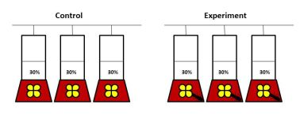

```{r, echo = FALSE, message = FALSE, warning = FALSE, results='hide'}

library(dplyr)
library(ggplot2)

# library(FactoMineR)
# library(factoextra)

library (lme4) 
# library (lmerTest) 

# Download data, filtering (to kepp only contr which for there is respective experiment)
# and set working directory for the output

# Data set for latency
setwd("D:\\JA\\Colibri\\Ms_Fear and Foraging\\Data\\Personality exp_latency")
lacy <- read.csv("latency.csv", header = TRUE, sep = ",")
lacy <- lacy %>% 
  dplyr::filter(Conf != "Ctrl0") %>%
  dplyr::filter(Conf != "Ctrl3") %>%
  gdata::drop.levels()

# Data set for exploration, risk avoidance and risk arousal
setwd("D:\\JA\\Colibri\\Ms_Fear and Foraging\\Data\\Personality exp_explor_risk_arousal")
persimpl <- read.csv("persIDc.csv", header = TRUE, sep = ",")
persimpl <- persimpl %>% 
  dplyr::filter(Configuration != "Ctrl0") %>%
  dplyr::filter(Configuration != "Ctrl3") %>%
  gdata::drop.levels()

library(dplyr)
xx <- persimpl %>% 
  group_by(ID..) %>%
  summarize(n = n())
  

# Working directory for the analysis output 
setwd("C:/Users/Kasia/Dropbox/FF_fear and foraging/Analysis") # old asus
 dir()

```
## Study question and rational

**For the experiment with ants:**  

1. It is now widely accepted that animal's foraging strategy (i.e. resourse exploitation) depends only on the amount/distribution of available food resources and animal motivation (marginal value theorem) but also predation pressure (Lime and Bednekoff, 1999)  

2. The intensity of prey vigilance depends on level of risk and proportion of predator presence. The risk allocation hypothesis (RAH) imposes that prey will allocate the time to foraging inversely proportionately to the predation pressure. The hypothesis usually tested in species that have an obvious predator/s.

3. Hummingbirds are rarely considered typical preys; rather do not have a specialized predator. However, they are often taken oportunistically by a wide range of predators, which imposes a great risk and favor evolution of anti-predator behaviours, including foraging strategy in the conditions of high  predation pressure. On the other hand, the hummingbirds, owing to the extremeally high metabolic rate, are very much driven by energy intake. That could constraint evolution of foraging strategy  (as a matter of fact, they would be expected to forage regardless of the risk level, so called paradox of RAH). 

**When including inter-individual variation**

4. Another question that may affects foraging perfomance is a behavioural profile/personality.... (to be elaborated)  


## Methods 

*Field.* Individually marked birds (n = 12) tested at the feeders exposed in the field (outside the lek area) - three feeders filled with ~ 30% sugar-water (Fig. 1). Total of three complete experimental sessions (control and experiment) performed within ca two weeks. Both control and experimental part of each session were performed at the same day (with the experimental part folowing the control). The video sessions recorded by camera, set up roughly in front of the feeders.



*Video analysis and data preparation.* Video recordings processed in Tracker and Cowlog softwares. Parameters measured and used in the analysis (calculated for each individual visit): 

+ **Total duration of feeding** (hereafter, total energy intake) - the total time spent at feeding (in secs; sum of all intervals with bill in the feeder). A proxy for energy intake.

+ **Latency to approach to the feeder** (hereafter latency) - the time between appearence in front of the feeder and onset of foraging (in secs); A proxy for risk assesment.  

+ **Number of breaks during foraging** (hereafter number of breaks) - the number of breaks during the foraging, standardized by the total time at the feeder. A proxy for coping with a fear.

+ **Duration of breaks during foraging** (hereafter mean duration of breaks) - an average duration of breaks  - mean calculated per foraging visit of an idividual. A proxy for risk assesment and coping with fear managment.

+ **Number of feeders changes** (hereafter, number of feeder changes) - the number of changes of the feeder during the visit, standardized by the total time spent at the feeder. A proxy for exploration. 

+ **Arousal** (hereafter, arousal) - amount/range of movements around the feeder. Calculated as coeficent of variance of the value established for each video frame basaed on the equation: sqrt((x~j~ - x~i~)^2^ + (y~j~ - y~i~)^2^), where x~i,j~ and y~i,j~ are cartesian coordinates of the bird position in the focal *i* and previous *j* video frame. The higher value, the higher arousal. A proxy for behavioural coping with stressful situation.


*Statistical analysis.* To compare the birds foraging performance  in the two circumnstance linear mixed model fit by REML was applied, with conditions - control/experimental treated as fixed factor, and birds ID as a random factor. 


## Results  

All the measured variables were affected by the treatment, except the number of feeders'changes and the number of breaks during the feeding. Latency to approach to the feeder and duration of breaks during feeding increased significantly in face of the experimental treatment, while the movement intensity decreased significantly (Fig. 2). In result total energy intake was smaller during the exerimental treatment (Fig. 2)


```{r, echo = FALSE, warning=FALSE, message = FALSE, results='hide'}
  
## Total energy intake
# Total duation of feeding (a proxy for energy intake) – analysed in regard to the configuration, with birds ID included in the model a a random effect.

########### Modelling  ############
# names(persimpl) # dataset
modelTE <- lmer(log(tot_durins) ~ treat + (1|Color.code), data = persimpl)
# plot(modelTE)
summary(modelTE)  
estimTE <- modelTE@beta[2]
lowcfTE <- confint(modelTE, level = .95)[4,1]
uppcfTE <- confint(modelTE, level = .95)[4,2]

########### Plot  ############
# ggplot(persimpl, aes(x = treat, y= tot_durins)) + geom_boxplot() +
#     theme_bw() +
#     scale_x_discrete(labels = c("Control",  "Experimental"), name = "Conditions")+
#     scale_y_continuous(name = "Total duration of the feeding [secs]")

```


```{r, echo = FALSE, message=FALSE, warning=FALSE, results = 'hide'}

# **Latency in approach to the feeder** 
  
#### Risk avoidance 1
# Latency in approach to the feeder (i.e. the time between appearence in front of the feeder and onset of foraging. Modelled in regard to the conditions (fixed factor; control vs experimental), with birds ID as a random factor

########### Modelling  ############
# names(lacy) # dataset
# modelRA1 <- lmer(Latency ~ ConfSimpl + (1|Colcode), data = lacy)
# plot(modelRA1)
modelRA1 <- lmer(log(Latency) ~ ConfSimpl + (1|Colcode), data = lacy)
summary(modelRA1)
estimRA1 <- modelRA1@beta[2]
lowcfRA1 <- confint(modelRA1, level = .95)[4,1]
uppcfRA1 <- confint(modelRA1, level = .95)[4,2]

########### Plot  #################
# ggplot(lacy, aes(y = Latency, x = ConfSimpl)) +
# geom_boxplot() +
#     theme_bw() +
#     scale_x_discrete(labels = c("Control",  "Experimental"), name = "Conditions")+
#     scale_y_continuous(name = "Latency [secs]")

    
```


``` {r, echo = FALSE, message = FALSE, warning = FALSE, results='hide'}

# **Number of breaks during foraging**   
  
## Risk avoidance 2  
# Two "competing" variables: stanouts (number of breaks during the foraging, standardized by the total time at the feeder) and mean_durouts (mean duration of breaks; mean calculated per foraging visit of an idividual).

########### Modelling  ############
# names(persimpl) # dataset
modelRA2a <- lmer(stan_nouts ~ treat + (1|Color.code), data = persimpl)
# plot(modelRA2a)
summary(modelRA2a)
estimRA2a <- modelRA2a@beta[2]
lowcfRA2a <- confint(modelRA2a, level = .95)[4,1]
uppcfRA2a <- confint(modelRA2a, level = .95)[4,2]


```


``` {r, echo = FALSE, message = FALSE, warning = FALSE, results='hide'}
# **Duration of breaks during foraging** 

modelRA2b <- lmer(mean_durouts ~ treat + (1|Color.code), data = persimpl)
# plot(modelRA2b)
summary(modelRA2b)
estimRA2b <- modelRA2b@beta[2]
lowcfRA2b <- confint(modelRA2b, level = .95)[4,1]
uppcfRA2b <- confint(modelRA2b, level = .95)[4,2]

########### Plot  ############
# ggplot(persimpl, aes(y = mean_durouts, x = treat)) +
#   geom_boxplot() +
#   theme_bw() +
#   scale_x_discrete(labels = c("Control",  "Experimental"), name = "Conditions")+
#   scale_y_continuous(name = "Standardized duration of breaks during the foraging")
#  
# 
# 
# ggplot(persimpl, aes(y = stan_nouts, x = treat)) +
#   geom_boxplot() +
#   theme_bw() +
#   scale_x_discrete(labels = c("Control",  "Experimental"), name = "Conditions")+
#   scale_y_continuous(name = "Standardized number of breaks during the foraging")
#  

```


``` {r, echo = FALSE, message = FALSE, warning = FALSE, results='hide'}

# **Number of feeders changes**
  
## Exploration   
# Two variables "competitive" variables:stannchange (number of changes of the feeder) and stannflo (number of diferent feeders used), both standardized by the total time spent at the feeder.

########### Modelling  ############
# names(persimpl) # dataset
# modelEa <- lmer(stan_nflo ~ treat + (1|Color.code), data = persimpl)
# plot(modelEa)
# modelEa <- lmer(log(stan_nflo+1) ~ treat + (1|Color.code), data = persimpl)
# # plot(modelEa)
# summary(modelEa)
# estimEa <- modelEa@beta[2]
# lowcfEa <- confint(modelEa, level = .90)[4,1]
# uppcfEa <- confint(modelEa, level = .90)[4,2]

modelEb <- lmer(log(stan_nflochang+1) ~ treat + (1|Color.code), data = persimpl)
# plot(modelEb)
summary(modelEb)
estimEb <- modelEb@beta[2]
lowcfEb <- confint(modelEb, level = .95)[4,1]
uppcfEb <- confint(modelEb, level = .95)[4,2]

########### Plot  ############
# ggplot(persimpl, aes(y = stan_nflo, x = treat)) +
# # ggplot(persimpl, aes(y = stan_nflochang, x = treat)) +
#     geom_boxplot() +
#     theme_bw() +
#     scale_x_discrete(labels = c("Control",  "Experimental"), name = "Conditions")+
#     scale_y_continuous(name = "Standardized number of feeders used")
#     # scale_y_continuous(name = "Standardized number of feeders change")
 


# ggplot(persimpl, aes(y = stan_nflochang, x = treat)) +
# # ggplot(persimpl, aes(y = stan_nflochang, x = treat)) +
#     geom_boxplot() +
#     theme_bw() +
#     scale_x_discrete(labels = c("Control",  "Experimental"), name = "Conditions")+
#     scale_y_continuous(name = "Standardized number of feeder changes")
#     # scale_y_continuous(name = "Standardized number of feeders change")
 

```


```{r, echo = FALSE, warning=FALSE, message = FALSE, results='hide'}

# **Arousal** 

# 
# Three traits: ferocity, speed and total distance. PCA performed to see if the three could be connected. 

########### PCA  ############
# names(persimpl) # dataset
# perspca <- persimpl [,12:14] # df need to consist of quatitive variables only
# res.pca <- PCA(perspca, graph = T)
# res.pca$eig # proportions of the retained varaitions 

########### Modelling  ############
# names(persimpl) # dataset
modelA <- lmer(log(mov_feroc) ~ treat + (1|Color.code), data = persimpl)
# plot(modelA)
summary(modelA)  
estimA <- modelA@beta[2]
lowcfA <- confint(modelA, level = .95)[4,1]
uppcfA <- confint(modelA, level = .95)[4,2]

########### Plot  ############
# ggplot(persimpl, aes(x = treat, y= mov_feroc)) + geom_boxplot() +
#     theme_bw() +
#     scale_x_discrete(labels = c("Control",  "Experimental"), name = "Conditions")+
#     scale_y_continuous(name = "Ferocity")

```


```{r, echo = FALSE, message=FALSE, warning=FALSE}

  ## Model esitmates for all variables

label <- c("risk_latency", "risk_number of breaks during foraging", "risk_mean duration of breaks", "explor_number of feeders changes", "arousal", "total energy intake")
estim <- c(estimRA1, estimRA2a, estimRA2b, estimEb, estimA, estimTE)
uppcf  <- c(uppcfRA1, uppcfRA2a, uppcfRA2b, uppcfEb, uppcfA, uppcfTE) 
lowcf  <- c(lowcfRA1, lowcfRA2a, lowcfRA2b, lowcfEb, lowcfA, lowcfTE) 

df <- data.frame(label, estim, lowcf, uppcf)
df$label <- factor(df$label, levels=rev(df$label))

# Plot
ggplot(data=df, aes(x=label, y=estim, ymin=lowcf, ymax=uppcf)) +
        geom_pointrange() + 
        coord_flip() +
        geom_hline(yintercept=0, lty=2) +  
        ylab("Model estimates and 95% CI") +
        theme_bw()  


```

Fig. 2. Model (*lmer*) estimates  of the difference between the control and experimental treatment; each variable considered separately.  


## Results interpretation

The birds change considerably their foraging performance when facing more direct danger (here imposed by large insects), clearly being more cautious (later onset of feeding, longer pauses during the feeding, less movement around the feeder). In result, their energy intake decreases considerably. The only variables that did not change were the number of feeder changes and the number of breaks during the foraging. Interpretation for the former could be that if an individual is satisfied with the quality and quantity of feed at given location does not have a great need to change that location during a single foraging visit; thus intially low number of feeder changes does not change in the condition of an increased predation risk. Interpretation of the lack of significant difference in the number of breaks during the feeding could be that these breaks are actually an output of the foraging technique (i.e. the birds need to break the feeding from time to time, to establish a satiation level? but see Lima 1999); thus the parameter do not change much, regardless of the foraging circumstances. 

## Next:

Analyze inter-individual variation in foraging performance (undisturbed condition/ based on video clips from the cognitive experiment - tracker analysis).  


Parameter that could be analysed:  

+ **latency** - BUT: we would have to established that from scratch; impossible to figure out that from Tracker output.

+ **duration of breaks** - BUT: first we need a code to extract that from the Tracker file (there is no direct info about in/out but there are x/y coordinates and time). This code could be made based on the files from experiments with ants, where the output from tracker is combined with output from cowlog (contains both info about x/y coordinates, time and whether bird was in/out of the feeder), unless is more efficient to go back to directly to video files??

+ **arousal** - no BUTs (data initally collected to measure this trait)
